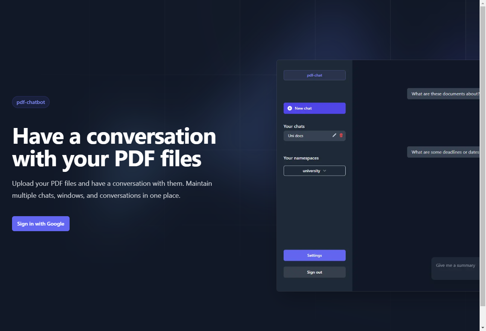
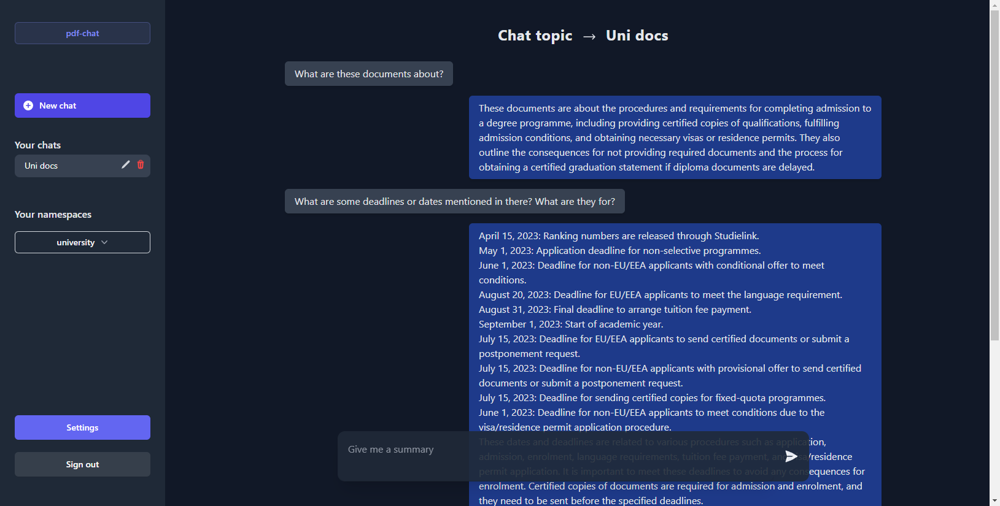

# ChatPDF Plus: GPT-4 x Pinecone x LangChain x MongoDB

## Features

- Create **multiple** topics to chat about
- Google OAuth to log in and store chats in MongoDB associated with your email
- Upload **any number of PDF files** to each topic
- Create **any number of chats** (chat windows) for each topic
- Upload files, convert them to embeddings, store the embeddings in a namespace and upload to Pinecone, and delete Pinecone namespaces **from within the browser**
- Upload and automatically **retrieve chat history** for all chats using MongoDB


`+ LangChain and Pinecone`

---

**Landing page**


---

**Main chat area**


---

**Settings page**


---

## Disclaimer

This repository was originally a fork of [GPT-4 & LangChain](https://github.com/mayooear/gpt4-pdf-chatbot-langchain) repository by [mayooear](https://github.com/mayooear/gpt4-pdf-chatbot-langchain). I planned on making small changes to satisfy my needs but ended up:

- adding several api routes (both for Pinecone and MongoDB)
- creating a bunch of new (large and small) components
- completely changing the styling
- setting up MongoDB
- converting all npm scripts to run within the browser
- and more misc changes

That's why I published this as a standalone repo. Nevertheless, some parts of this readme.md are borrowed from there too.

---

## Local setup

### 1. Clone the repo

```
git clone https://github.com/dissorial/pdf-chatbot.git
```

This repository has two branches: `master` and `old-master`. The `old-master` branch contains working code that you can run locally and has all the features except for Google OAuth. If you want to avoid setting up Google OAuth, clone that branch with:

```
$ git clone https://github.com/dissorial/pdf-chatbot.git -b old-master
```

### 2. Install packages

```
yarn install
```

### 3. Set up your `.env` file

- Rename `.env.example` to `.env`
- Your `.env` file should look like this:

```
OPENAI_API_KEY=

PINECONE_API_KEY=
PINECONE_ENVIRONMENT=
PINECONE_INDEX_NAME=

MONGODB_URI=

GOOGLE_CLIENT_ID=
GOOGLE_CLIENT_SECRET=
NEXTAUTH_URL=
JWT_SECRET=
ALLOWED_EMAIL_DOMAIN='@example.com'
```

#### OpenAI API

- Visit [OpenAI](https://help.openai.com/en/articles/4936850-where-do-i-find-my-secret-api-key) to retrieve API keys and insert into your `.env` file

#### Pinecone

- Visit [Pinecone](https://pinecone.io/) to create and retrieve your API keys, and also retrieve your environment and index name from the dashboard.

#### MongoDB

- Visit [MongoDB](https://mongodb.com/), create a database (free one is enough for these purposes) and retrieve your URI in Connect -> Drivers

#### JWT

- To generate your JWT_SECRET, you can run `openssl rand -base64 32` in terminal

#### Google OAuth (Client ID and secret)

- Read [this guide](https://support.google.com/cloud/answer/6158849?hl=en) from Google

#### NextAuth URL

- You can use `http://localhost:3000`

#### Allowed email domain

- Change '@example.com' to '@gmail.com' or other domains. If you want to use any email domain, remove `callback` from options in `pages/api/auth/[...nextauth].ts`

### Other

- In `utils/makechain.ts`, adjust the `QA_PROMPT` for your own usecase. Change `modelName` in `new OpenAI` to `gpt-4`, if you have access to `gpt-4` api.

---

## Run the app

Run `npm run dev`. Once the local dev environment launches, go to `Settings` in the bottom left corner. Upload your PDF files and give them a 'namespace'. Here, 'namespace' is synonymous with being the topic of your conversation. This way, you can upload multiple files to multiple namespaces, and maintain several conversations about different topics and documents.

---

## Chatting with PDF files

If you retrun to the home page now, you should see your namespace on the left sidebar. Click on it, create a new chat and have a conversation with the PDF files embedded for that particular namespace.

---

## Troubleshooting

### General errors

- Make sure that you are running the latest version of Node. To check your version run node -v.
- If you're encountering issues with a specific PDF, try converting it to text first or try a different PDF file. It's possible that the PDF is corrupted, scanned, or requires OCR to be converted to text.
- Consider logging the env variables and ensure that they are properly exposed.
- Confirm that you're using the same versions of LangChain and Pinecone as this repository.
- Check that you've created an .env file that contains your valid API keys, environment, and index name.
- Ensure that you do not have multiple OPENAPI keys in your global environment. If multiple keys exist, the local env file in the project will be overwritten by the system's env variable.

### Pinecone errors

- Make sure that your Pinecone dashboard environment and index match the values in the .env file.
- Confirm that you've set the vector dimensions to 1536.
- Note that Pinecone indexes for users on the Starter (free) plan are deleted after 7 days of inactivity. To prevent this, send an API request to Pinecone to reset the counter before 7 days.
- If issues persist, consider starting fresh with a new Pinecone project, index, and cloned repository.

---

## Credit

_Frontend of this repo is inspired by ChatGPT._
