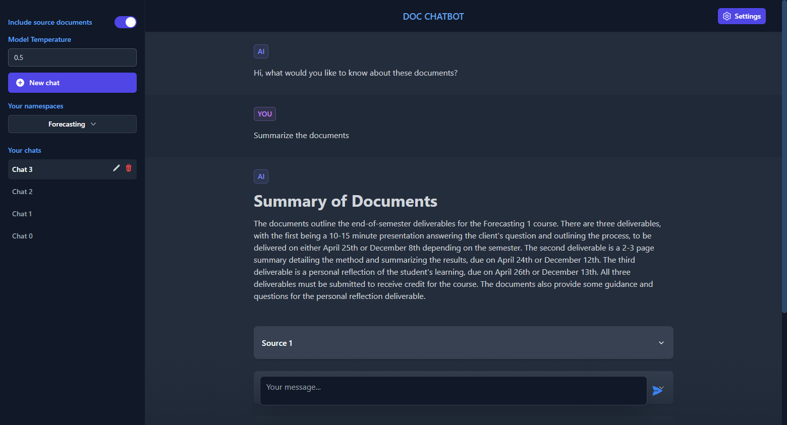
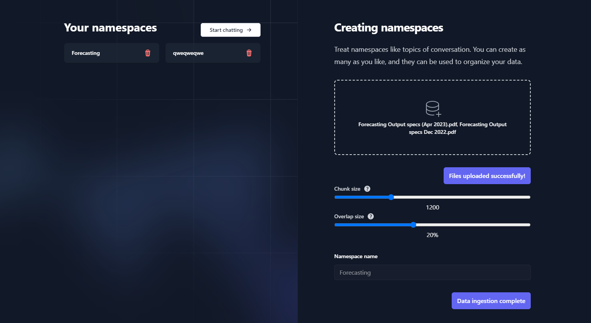

# doc-chatbot: GPT x Pinecone x LangChain

## Features

- Create **multiple** topics to chat about
- Store **any number of files** to each topic
- Create **any number of chats** (chat windows) for each topic
- Upload files, convert them to embeddings, store the embeddings in a namespace and upload to Pinecone, and delete Pinecone namespaces **from within the browser**
- Store and automatically **retrieve chat history** for all chats with local storage
- Supports `.pdf`, `.docx` and `.txt`


`+ LangChain and Pinecone`

Note: If you'd like to set this up with google auth and mongoDB (as opposed to no auth and using local storage), have a look at this branch: [mongodb-and-auth](https://github.com/dissorial/doc-chatbot/tree/mongodb-and-auth)

**Main chat area**


---

**Settings page**



---

## Disclaimer

---

## Local setup

### Clone the repo

```
git clone https://github.com/dissorial/pdf-chatbot.git
```

---

### Pinecone setup

Create an account on Pinecone. Go to `Indexes` and `Create index`. Enter any name, put `1536` for `Dimensions` and leave the rest on default. Then go to `API keys` and `Create API key`.

---

### Install packages

```
yarn install
```

---

### Set up your `.env` file

- Rename `.env.example` to `.env`
- Your `.env` file should look like this:

```
OPENAI_API_KEY=

PINECONE_API_KEY=
PINECONE_ENVIRONMENT=
PINECONE_INDEX_NAME=

NEXTAUTH_URL=http://localhost:3000
NEXTAUTH_SECRET=

JWT_SECRET=

NODE_ENV=development
```

---

### OpenAI API

- Visit [OpenAI](https://help.openai.com/en/articles/4936850-where-do-i-find-my-secret-api-key) to retrieve API keys and insert into your `.env` file

### NextAuth Secret

- You can generate this by running `openssl rand -base64 32` in Git Bash.

### JWT Secret

- You can generate this by running `openssl rand -base64 32` in Git Bash.

### NextAuth URL

- Default is http://localhost:3000. In production, this should be the URL of your deployed app.

### Node environment

- development by default. In production, set this to 'production' (without the quotes)

### Other

- In `utils/makechain.ts`, adjust the `QA_PROMPT` for your own usecase. Change `modelName` in `new OpenAI` to `gpt-4`, if you have access to `gpt-4` api.

---

## Run the app

Run `npm run dev`. Once the local dev environment launches, go to `Settings` in the top right corner. Upload your files and give them a 'namespace'. Here, 'namespace' is synonymous with being the topic of your conversation. This way, you can upload multiple files to multiple namespaces, and maintain several conversations about different topics and documents.

---

## Chatting with files

If you retrun to the home page now, you should see your namespace(s) on the left sidebar. Click on it, create a new chat and have a conversation with the files embedded for that particular namespace.

---

## Troubleshooting

### General errors

- Make sure that you are running the latest version of Node. To check your version run node -v.
- If you're encountering issues with a specific file, try converting it to text first or try a different file. It's possible that the file is corrupted, scanned, or requires OCR to be converted to text.
- Confirm that you're using the same versions of LangChain and Pinecone as this repository.
- Check that you've created an .env file that contains your valid API keys, environment, and index name.
- Ensure that you do not have multiple OPENAPI keys in your global environment. If multiple keys exist, the local env file in the project will be overwritten by the system's env variable.

### Pinecone errors

- Make sure that your Pinecone dashboard environment and index match the values in the .env file.
- Confirm that you've set the vector dimensions to 1536.
- Note that Pinecone indexes for users on the Starter (free) plan are deleted after 7 days of inactivity. To prevent this, send an API request to Pinecone to reset the counter before 7 days.
- If issues persist, consider starting fresh with a new Pinecone project, index, and cloned repository.

---

## Credit

This repository was originally a fork of [GPT-4 & LangChain](https://github.com/mayooear/gpt4-pdf-chatbot-langchain) repository by [mayooear](https://github.com/mayooear/gpt4-pdf-chatbot-langchain) but underwent many major changes in this repo.

_Frontend of this repo is inspired by ChatGPT._
