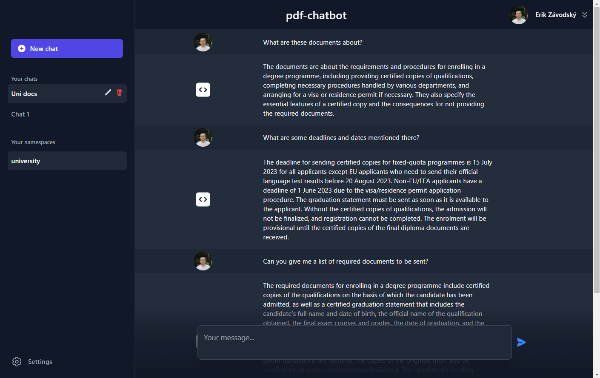
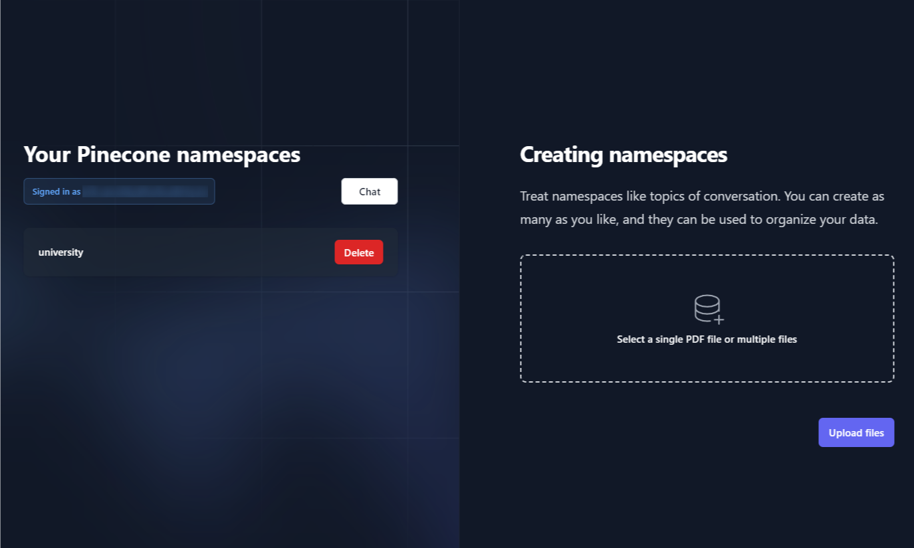

# doc-chatbot: GPT-4 x Pinecone x LangChain x MongoDB

**NOTE – the right-hand side contains a link to the deployed version of this app, but you won't be able to log in with Google if you try. I am using my own API keys there and therefore restrict the access only to myself. Follow the intructions below to run or deploy your own version.**

## Features

- Create **multiple** topics to chat about
- Google OAuth to log in and store chats in MongoDB associated with your email
- Upload **any number of files** to each topic
- Create **any number of chats** (chat windows) for each topic
- Upload files, convert them to embeddings, store the embeddings in a namespace and upload to Pinecone, and delete Pinecone namespaces **from within the browser**
- Upload and automatically **retrieve chat history** for all chats using MongoDB
- Supports `.pdf`, `.docx` and `.txt`


`+ LangChain and Pinecone`

**Main chat area**


---

**Settings page**



---

## Disclaimer

This repository was originally a fork of [GPT-4 & LangChain](https://github.com/mayooear/gpt4-pdf-chatbot-langchain) repository by [mayooear](https://github.com/mayooear/gpt4-pdf-chatbot-langchain). I planned on making small changes to satisfy my needs but ended up:

- adding several api routes (both for Pinecone and MongoDB)
- creating a bunch of new (large and small) components
- completely changing the styling
- setting up MongoDB
- converting all npm scripts to run within the browser
- and more misc changes

That's why I published this as a standalone repo. Nevertheless, some parts of this readme.md are borrowed from there too.

---

## Local setup

### Clone the repo

```
git clone https://github.com/dissorial/pdf-chatbot.git
```

---

### Pinecone setup

Create an account on Pinecone. Go to `Indexes` and `Create index`. Enter any name, put `1536` for `Dimensions` and leave the rest on default. Then go to `API keys` and `Create API key`.

---

### MongoDB setup

Create an account on MongoDB. In your dashboard, click `New Project` and name it. Then, click `Create project`. You'll be redirected to `Database Deployments` page. Click `Build a database`, and choose `M0 FREE`. Choose any provider and region, but you can leave it as-is. At the bottom, give your cluster a name, and click `Create`.

Username and password should be pre-filled here. Click `Create user`. In `IP access list`, click `Add my current API address`, then `Finish and close` and `Go to databases`. Next to your cluster, there will be a `Connect` button. Click in, then go to `Drivers`. You'll find your MongoDB_URI under `Add your connection string into your application code`. Copy this to your `env` and replace `<password>` with your password (the one used when you clicked 'Create user'). Done.

---

### Google Auth Setup

Go to Google Developer Console and create a new project.

#### OAuth conset screen

- Navigate to `APIs & Serivces`, then `OAuth consent screen`. Click on `External`, then `Create`. Give the app a name, fill out the fields for emails/developer contact information and then continue. In the `Scopes` section, click `Add or remove scopes` and check `.../auth.userinfo.email`, then `Save and continue`. In the `Test users section`, add yourself (your email), then `Save and Continue` and then `Back to dashboard`.

#### Credentials

Go to `Credentials` (still under APIs and Services) and click `Create credentials`, then `OAuth Client ID`. Selectd `Web application` under `Application type` and give it any name.

Under `Authorized JavaScript origins`, add `http://localhost:3000`.
Under `Authorized redirect URIs`, add `http://localhost:3000/api/auth/callback/google`.

Then `Create`. This will also show your Google Client ID and secret.

---

### Install packages

```
yarn install
```

---

### Set up your `.env` file

- Rename `.env.example` to `.env`
- Your `.env` file should look like this:

```
OPENAI_API_KEY=

PINECONE_API_KEY=
PINECONE_ENVIRONMENT=
PINECONE_INDEX_NAME=

MONGODB_URI=''

GOOGLE_CLIENT_ID=
GOOGLE_CLIENT_SECRET=

NEXTAUTH_URL=http://localhost:3000
NEXTAUTH_SECRET=

JWT_SECRET=

ALLOWED_EMAIL_DOMAIN='@gmail.com'

NODE_ENV=development
```

---

### OpenAI API

- Visit [OpenAI](https://help.openai.com/en/articles/4936850-where-do-i-find-my-secret-api-key) to retrieve API keys and insert into your `.env` file

### NextAuth Secret

- You can generate this by running `openssl rand -base64 32` in Git Bash.

### JWT Secret

- You can generate this by running `openssl rand -base64 32` in Git Bash.

### NextAuth URL

- Default is http://localhost:3000. In production, this should be the URL of your deployed app.

### Allowed email domain

- '@gmail.com' by default. If you want to use any email domain, remove `callback` from options in `pages/api/auth/[...nextauth].ts`

### Node environment

- development by default. In production, set this to 'production' (without the quotes)

### Other

- In `utils/makechain.ts`, adjust the `QA_PROMPT` for your own usecase. Change `modelName` in `new OpenAI` to `gpt-4`, if you have access to `gpt-4` api.

---

## Run the app

Run `npm run dev`. Once the local dev environment launches, log in with Google, and then go to `Settings` in the bottom left corner. Upload your files and give them a 'namespace'. Here, 'namespace' is synonymous with being the topic of your conversation. This way, you can upload multiple files to multiple namespaces, and maintain several conversations about different topics and documents.

---

## Chatting with files

If you retrun to the home page now, you should see your namespace(s) on the left sidebar. Click on it, create a new chat and have a conversation with the files embedded for that particular namespace.

---

## Troubleshooting

### General errors

- Make sure that you are running the latest version of Node. To check your version run node -v.
- If you're encountering issues with a specific file, try converting it to text first or try a different file. It's possible that the file is corrupted, scanned, or requires OCR to be converted to text.
- Consider logging the env variables and ensure that they are properly exposed.
- Confirm that you're using the same versions of LangChain and Pinecone as this repository.
- Check that you've created an .env file that contains your valid API keys, environment, and index name.
- Ensure that you do not have multiple OPENAPI keys in your global environment. If multiple keys exist, the local env file in the project will be overwritten by the system's env variable.

### Pinecone errors

- Make sure that your Pinecone dashboard environment and index match the values in the .env file.
- Confirm that you've set the vector dimensions to 1536.
- Note that Pinecone indexes for users on the Starter (free) plan are deleted after 7 days of inactivity. To prevent this, send an API request to Pinecone to reset the counter before 7 days.
- If issues persist, consider starting fresh with a new Pinecone project, index, and cloned repository.

---

## Credit

_Frontend of this repo is inspired by ChatGPT._
